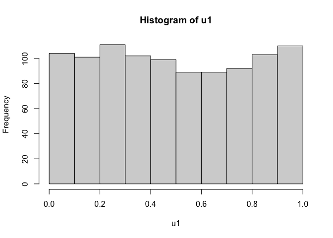
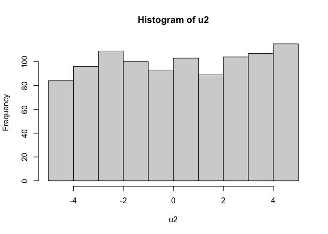

R_Module3_Practice_Problem
================

## R-Class Module 3 Practice Problem 1

#### 1. Use help() to read the R documentation of Uniform Number Generator runif()

``` r
help(runif)
```

#### 2. Use runif() to generate a vector u1 of length 1000 with default min and max of the interval

``` r
u1 <- runif(n = 1000)
```

#### 3. Compute the min(),max(),mean() of u1

``` r
min(u1)
```

    ## [1] 0.002852971

``` r
max(u1)
```

    ## [1] 0.9963609

``` r
mean(u1)
```

    ## [1] 0.4955325

#### 4. Plot the histogram of u1

``` r
hist(u1)
```

<!-- -->

#### 5. Use runif() to generate a vector u2 of length 1000 with min -5 and max 5

``` r
u2 <- runif(1000, -5, 5)
```

#### 6. Compute min(),max(),mean() and plot the histogram of u2

``` r
min(u2)
```

    ## [1] -4.999955

``` r
max(u2)
```

    ## [1] 4.975115

``` r
mean(u2)
```

    ## [1] 0.1533352

``` r
hist(u2)
```

<!-- -->
