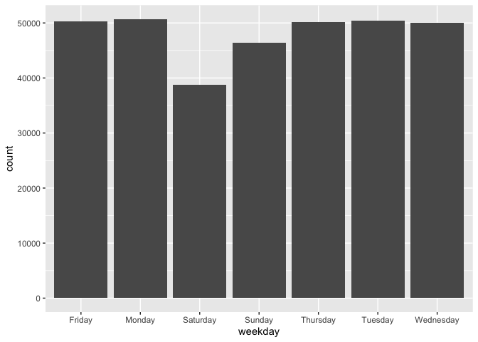
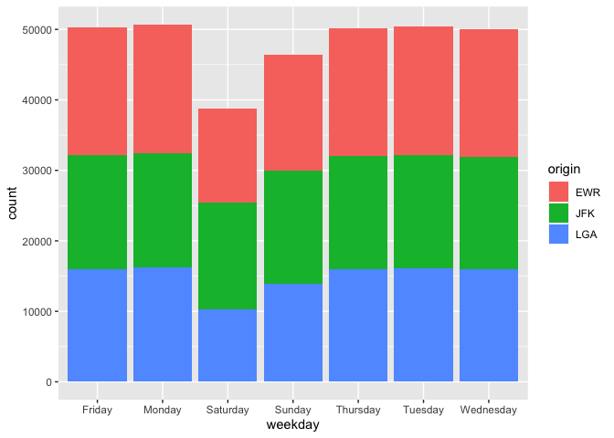
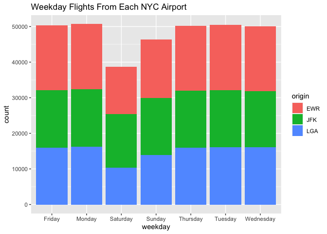
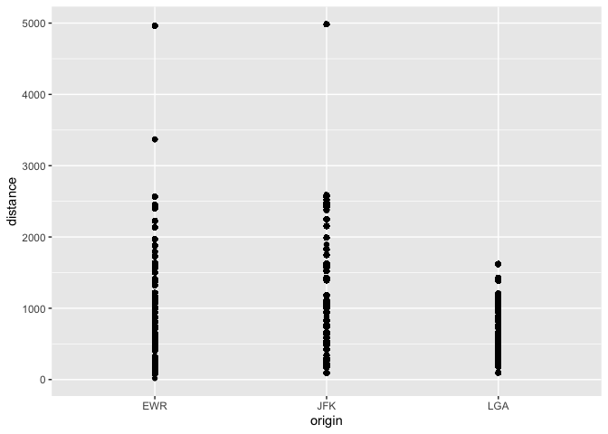

R_Module5_Practice_Problem
================

## R-Class Module 5 Practice Problem 1

#### 1. Construct a function c_to_f(): Convert Celsius to Fahrenheit

-   Input: Celsius
-   Statement: Fahrenheit = Celsius\*1.8+32
-   Output: Fahrenheit

``` r
c_to_f = function(Celsius) {
        Fahrenheit = Celsius * 1.8 + 32
        return(Fahrenheit)
}
```

#### 2. Convert 26 Celsius to Fahrenheit

``` r
c_to_f(26)
```

    ## [1] 78.8

## R-Class Module 5 Practice Problem 2

#### 1. Download the data file from

<https://www.dropbox.com/s/yy64i1ekeoo9wga/nyc_flights.csv?dl=0> (CSV)
<https://www.dropbox.com/s/4hj71qxh1a8r23e/nyc_flights.RData?dl=0>
(RData)

#### 2. Import nyc_flights.csv to the R environment, save as a data.frame “flights”

``` r
flights <- read.csv("/Users/hyeonwooyang/Desktop/Desktop/0_WUSTL/0_Business_Analytics/02_pre_coursework/01_Intro_to_R_Programming/Project/My_R_Project/data/nyc_flights.csv")
```

#### 3. Write your code to answer the following question

How many flights are observed?

``` r
nrow(flights)
```

    ## [1] 336776

How many flights are observed each month?

``` r
table(flights$month)
```

    ## 
    ##     1     2     3     4     5     6     7     8     9    10    11    12 
    ## 27004 24951 28834 28330 28796 28243 29425 29327 27574 28889 27268 28135

What is the maximum dep_delay(departure delay time)?

``` r
# install.packages("dplyr")
library(dplyr)
```

    ## Warning: package 'dplyr' was built under R version 4.0.5

    ## 
    ## Attaching package: 'dplyr'

    ## The following objects are masked from 'package:stats':
    ## 
    ##     filter, lag

    ## The following objects are masked from 'package:base':
    ## 
    ##     intersect, setdiff, setequal, union

``` r
summarise(flights, max(dep_delay, na.rm = TRUE))
```

    ##   max(dep_delay, na.rm = TRUE)
    ## 1                         1301

What is the maximum air_time?

``` r
summarise(flights, max(air_time, na.rm = TRUE))
```

    ##   max(air_time, na.rm = TRUE)
    ## 1                         695

#### 4. Create a new object flights_sample with the first 1000 rows of flights

``` r
flights_sample <- flights[1:1000, ]
```

#### 5. Save the flights_sample to a RData file “flights_sample.RData”

``` r
save(flights_sample, file = "flights_sample.RData")
```

#### 6. Remove the object flights_sample from the environment.

``` r
rm(flights_sample)
```

#### 7. Load the object flights_sample from the RData file.

``` r
load("flights_sample.RData")
```

## R-Class Module 5 Practice Problem 3

#### 1. Create a new data.frame “flights_1” with the month, day, origin, dest, air_time columns from flights

``` r
flights_1 <- select(flights, month, day, origin, dest, air_time)
```

#### 2. Order “flights_1” by ascending air_time

``` r
flights_1 <- arrange(flights_1, air_time)
```

#### 3. Print the first 10 rows of “flights_1”

``` r
flights_1[1:10, ]
```

    ##    month day origin dest air_time
    ## 1      1  16    EWR  BDL       20
    ## 2      4  13    EWR  BDL       20
    ## 3     12   6    EWR  BDL       21
    ## 4      2   3    EWR  PHL       21
    ## 5      2   5    EWR  BDL       21
    ## 6      2  12    EWR  PHL       21
    ## 7      3   2    LGA  BOS       21
    ## 8      3   8    JFK  PHL       21
    ## 9      3  18    EWR  BDL       21
    ## 10     3  19    EWR  BDL       21

#### 4. Calculate the average air_time for all the flights whose origin is LGA on January 1st

``` r
filter(flights_1, month == 1, day == 1, origin == "LGA") %>%
        summarise(mean(air_time, na.rm = TRUE))
```

    ##   mean(air_time, na.rm = TRUE)
    ## 1                     144.3305

## R-Class Module 5 Practice Problem 4

#### 1. Group the flights by route: origin+dest

``` r
flights %>%
        group_by(origin, dest)
```

    ## # A tibble: 336,776 x 20
    ## # Groups:   origin, dest [224]
    ##        X  year month   day dep_time sched_dep_…¹ dep_d…² arr_t…³ sched…⁴ arr_d…⁵
    ##    <int> <int> <int> <int>    <int>        <int>   <int>   <int>   <int>   <int>
    ##  1     1  2013     1     1      517          515       2     830     819      11
    ##  2     2  2013     1     1      533          529       4     850     830      20
    ##  3     3  2013     1     1      542          540       2     923     850      33
    ##  4     4  2013     1     1      544          545      -1    1004    1022     -18
    ##  5     5  2013     1     1      554          600      -6     812     837     -25
    ##  6     6  2013     1     1      554          558      -4     740     728      12
    ##  7     7  2013     1     1      555          600      -5     913     854      19
    ##  8     8  2013     1     1      557          600      -3     709     723     -14
    ##  9     9  2013     1     1      557          600      -3     838     846      -8
    ## 10    10  2013     1     1      558          600      -2     753     745       8
    ## # … with 336,766 more rows, 10 more variables: carrier <chr>, flight <int>,
    ## #   tailnum <chr>, origin <chr>, dest <chr>, air_time <int>, distance <int>,
    ## #   hour <int>, minute <int>, time_hour <chr>, and abbreviated variable names
    ## #   ¹​sched_dep_time, ²​dep_delay, ³​arr_time, ⁴​sched_arr_time, ⁵​arr_delay

#### 2. Calculate the total number of flights, average dep_delay, average arr_delay for each route

``` r
flights %>%
        group_by(origin, dest) %>%
        summarise(flights = n(),
                  avg_dep_delay = mean(dep_delay, na.rm = TRUE),
                  avg_arr_delay = mean(arr_delay, na.rm = TRUE))
```

    ## `summarise()` has grouped output by 'origin'. You can override using the
    ## `.groups` argument.

    ## # A tibble: 224 x 5
    ## # Groups:   origin [3]
    ##    origin dest  flights avg_dep_delay avg_arr_delay
    ##    <chr>  <chr>   <int>         <dbl>         <dbl>
    ##  1 EWR    ALB       439         23.6         14.4  
    ##  2 EWR    ANC         8         12.9         -2.5  
    ##  3 EWR    ATL      5022         15.5         13.2  
    ##  4 EWR    AUS       968         11.5         -0.474
    ##  5 EWR    AVL       265          8.62         8.80 
    ##  6 EWR    BDL       443         17.7          7.05 
    ##  7 EWR    BNA      2336         17.7         12.7  
    ##  8 EWR    BOS      5327         12.5          4.78 
    ##  9 EWR    BQN       297         23.9         10.9  
    ## 10 EWR    BTV       931         17.8         12.2  
    ## # … with 214 more rows

#### 3. Order the return by descending avearge dep_delay time

``` r
flights %>%
        group_by(origin, dest) %>%
        summarise(flights = n(),
                  avg_dep_delay = mean(dep_delay, na.rm = TRUE),
                  avg_arr_delay = mean(arr_delay, na.rm = TRUE)) %>%
        arrange(desc(avg_dep_delay))
```

    ## `summarise()` has grouped output by 'origin'. You can override using the
    ## `.groups` argument.

    ## # A tibble: 224 x 5
    ## # Groups:   origin [3]
    ##    origin dest  flights avg_dep_delay avg_arr_delay
    ##    <chr>  <chr>   <int>         <dbl>         <dbl>
    ##  1 EWR    TYS       323          41.8          41.2
    ##  2 EWR    CAE       104          36.3          44.6
    ##  3 EWR    TUL       315          34.9          33.7
    ##  4 LGA    SBN         6          31.3          14.5
    ##  5 EWR    OKC       346          30.6          30.6
    ##  6 LGA    BHM       296          29.8          17.0
    ##  7 LGA    CAE        12          29.5          19.7
    ##  8 EWR    DSM       411          29.3          23.5
    ##  9 EWR    JAC        23          28.7          29.9
    ## 10 EWR    ROC       513          27.9          20.7
    ## # … with 214 more rows

#### 4. Group the flights by carrier

``` r
flights %>%
        group_by(carrier)
```

    ## # A tibble: 336,776 x 20
    ## # Groups:   carrier [16]
    ##        X  year month   day dep_time sched_dep_…¹ dep_d…² arr_t…³ sched…⁴ arr_d…⁵
    ##    <int> <int> <int> <int>    <int>        <int>   <int>   <int>   <int>   <int>
    ##  1     1  2013     1     1      517          515       2     830     819      11
    ##  2     2  2013     1     1      533          529       4     850     830      20
    ##  3     3  2013     1     1      542          540       2     923     850      33
    ##  4     4  2013     1     1      544          545      -1    1004    1022     -18
    ##  5     5  2013     1     1      554          600      -6     812     837     -25
    ##  6     6  2013     1     1      554          558      -4     740     728      12
    ##  7     7  2013     1     1      555          600      -5     913     854      19
    ##  8     8  2013     1     1      557          600      -3     709     723     -14
    ##  9     9  2013     1     1      557          600      -3     838     846      -8
    ## 10    10  2013     1     1      558          600      -2     753     745       8
    ## # … with 336,766 more rows, 10 more variables: carrier <chr>, flight <int>,
    ## #   tailnum <chr>, origin <chr>, dest <chr>, air_time <int>, distance <int>,
    ## #   hour <int>, minute <int>, time_hour <chr>, and abbreviated variable names
    ## #   ¹​sched_dep_time, ²​dep_delay, ³​arr_time, ⁴​sched_arr_time, ⁵​arr_delay

#### 5. Calculate the total number of flights,average dep_delay, average arr_delay, total distance covered for each carrier

``` r
flights %>%
        group_by(carrier) %>%
        summarise(flights = n(),
                  avg_dep_delay = mean(dep_delay, na.rm = TRUE),
                  avg_arr_delay = mean(arr_delay, na.rm = TRUE),
                  total_distance = sum(distance)
                  )
```

    ## # A tibble: 16 x 5
    ##    carrier flights avg_dep_delay avg_arr_delay total_distance
    ##    <chr>     <int>         <dbl>         <dbl>          <int>
    ##  1 9E        18460         16.7          7.38         9788152
    ##  2 AA        32729          8.59         0.364       43864584
    ##  3 AS          714          5.80        -9.93         1715028
    ##  4 B6        54635         13.0          9.46        58384137
    ##  5 DL        48110          9.26         1.64        59507317
    ##  6 EV        54173         20.0         15.8         30498951
    ##  7 F9          685         20.2         21.9          1109700
    ##  8 FL         3260         18.7         20.1          2167344
    ##  9 HA          342          4.90        -6.92         1704186
    ## 10 MQ        26397         10.6         10.8         15033955
    ## 11 OO           32         12.6         11.9            16026
    ## 12 UA        58665         12.1          3.56        89705524
    ## 13 US        20536          3.78         2.13        11365778
    ## 14 VX         5162         12.9          1.76        12902327
    ## 15 WN        12275         17.7          9.65        12229203
    ## 16 YV          601         19.0         15.6           225395

#### 6. Order the return with descending avg_arr_delay

``` r
flights %>%
        group_by(carrier) %>%
        summarise(flights = n(),
                  avg_dep_delay = mean(dep_delay, na.rm = TRUE),
                  avg_arr_delay = mean(arr_delay, na.rm = TRUE),
                  total_distance = sum(distance)
                  ) %>%
        arrange(desc(avg_arr_delay))
```

    ## # A tibble: 16 x 5
    ##    carrier flights avg_dep_delay avg_arr_delay total_distance
    ##    <chr>     <int>         <dbl>         <dbl>          <int>
    ##  1 F9          685         20.2         21.9          1109700
    ##  2 FL         3260         18.7         20.1          2167344
    ##  3 EV        54173         20.0         15.8         30498951
    ##  4 YV          601         19.0         15.6           225395
    ##  5 OO           32         12.6         11.9            16026
    ##  6 MQ        26397         10.6         10.8         15033955
    ##  7 WN        12275         17.7          9.65        12229203
    ##  8 B6        54635         13.0          9.46        58384137
    ##  9 9E        18460         16.7          7.38         9788152
    ## 10 UA        58665         12.1          3.56        89705524
    ## 11 US        20536          3.78         2.13        11365778
    ## 12 VX         5162         12.9          1.76        12902327
    ## 13 DL        48110          9.26         1.64        59507317
    ## 14 AA        32729          8.59         0.364       43864584
    ## 15 HA          342          4.90        -6.92         1704186
    ## 16 AS          714          5.80        -9.93         1715028

## R-Class Module 5 Practice Problem 5

#### Plot barplot with ggplot

#### 1. A bar plot on count of flights for each weekday

``` r
# install.packages("lubridate")
library(lubridate)
```

    ## 
    ## Attaching package: 'lubridate'

    ## The following objects are masked from 'package:base':
    ## 
    ##     date, intersect, setdiff, union

``` r
# install.packages("ggplot2")
library(ggplot2)

flights$weekday = weekdays(ymd_hms(flights$time_hour))

ggplot(flights) + geom_bar(aes(x = weekday))
```

<!-- -->
\#### 2. A colored bar plot on count of flights for each weekday from
each origin

``` r
ggplot(flights) + geom_bar(aes(x = weekday, fill = origin))
```

<!-- -->
\#### 3. Add a titile “Weekday Flights From Each NYC Airport” to your
plot

``` r
ggplot(flights) + geom_bar(aes(x = weekday, fill = origin)) + labs(title = "Weekday Flights From Each NYC Airport")
```

<!-- -->

#### Plot scatter point plot with ggplot

#### 4. A scatter plot on distance for each airport

#### 5. X axis is origin

#### 6. Y axis is distance

``` r
ggplot(flights) + geom_point(aes(x = origin, y = distance))
```

<!-- -->
